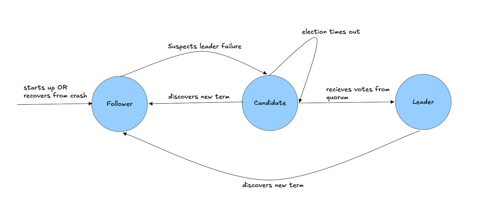

# go-raft

## State Machine



A from-scratch implementation of the [Raft consensus algorithm](https://raft.github.io/) in Go, plus a
replicated key-value store (`cmd/kvapi`) built on top of it to show the library in use.

The goal is a readable, dependency-free Raft: the whole consensus layer lives in a single file
(`raft.go`, ~600 lines) using only the Go standard library — `net/rpc` for peer communication and
`encoding/gob` for durable state.

## What's implemented

- **Leader election** — randomized election timeouts, `RequestVote` RPC, term-based vote granting
  with the up-to-date-log check from §5.4.1.
- **Log replication** — `AppendEntries` RPC, `nextIndex` back-off on rejection, conflicting-entry
  truncation (§5.3), and batching (up to 8000 entries per RPC).
- **Commit and apply** — the leader advances `commitIndex` on quorum `matchIndex`; every node applies
  committed entries to a user-supplied state machine in order.
- **Persistence** — `currentTerm`, `votedFor` and the log are gob-encoded to `md_<id>.dat` and
  `fsync`'d before an RPC is answered; a restarted node restores from that file.
- **Pluggable state machine** — implement `Apply(cmd []byte) ([]byte, error)` and hand it to
  `NewServer`.

## Layout

| Path | What it is |
| --- | --- |
| `raft.go` | The consensus library (package `goraft`) — server state, RPC handlers, election, replication, persistence. |
| `cmd/kvapi/main.go` | Demo app: a replicated key-value store with an HTTP API over the Raft library. |

## Requirements

Go 1.26.1 or newer (see `go.mod`). No external dependencies.

## Running the key-value demo

Build it:

```sh
go build -o cmd/kvapi/kvapi ./cmd/kvapi
```

Then start three nodes, each in its own terminal. `--node` is this server's index into the
`--cluster` list, `--cluster` is a `;`-separated list of `id,address` pairs, and `--http` is the
address the key-value API listens on:

```sh
# terminal 1
./cmd/kvapi/kvapi --node 0 --http :2020 --cluster "1,:3030;2,:3031;3,:3032"

# terminal 2
./cmd/kvapi/kvapi --node 1 --http :2021 --cluster "1,:3030;2,:3031;3,:3032"

# terminal 3
./cmd/kvapi/kvapi --node 2 --http :2022 --cluster "1,:3030;2,:3031;3,:3032"
```

Each node writes its durable state to `md_<id>.dat` in the current working directory, so as long as
the ids are distinct the three nodes can share a directory (that is where the `md_1.dat`, `md_2.dat`
and `md_3.dat` files under `cmd/kvapi/` come from — they are gitignored).

Once a leader is elected, write and read through it:

```sh
# writes must go to the leader; followers return an error
curl "http://localhost:2020/set?key=x&value=1"

# linearizable read — goes through the Raft log
curl "http://localhost:2020/get?key=x"
1

# relaxed read — reads the local state machine directly, skipping consensus
curl "http://localhost:2020/get?key=x&relaxed=true"
1
```

## Using the library directly

```go
import goraft "github.com/chokoskoder/raft"

type myStateMachine struct{ /* ... */ }

func (m *myStateMachine) Apply(cmd []byte) ([]byte, error) {
	// interpret cmd, mutate state, return a result
	return nil, nil
}

cluster := []goraft.ClusterMember{
	{Id: 1, Address: ":3030"},
	{Id: 2, Address: ":3031"},
	{Id: 3, Address: ":3032"},
}

s := goraft.NewServer(cluster, &myStateMachine{}, "./metadata", 0 /* this node's index */)
s.Debug = true // verbose per-node trace logging
go s.Start()

// Only valid on the leader; returns goraft.ErrApplyToLeader otherwise.
results, err := s.Apply([][]byte{[]byte("some-command")})
```

Ids must be non-zero — `0` is reserved to mean "voted for nobody".

## Roadmap — three things worth adding next

### 1. A test suite (unit tests plus a deterministic cluster harness)

There is currently no test file in the repo, which for a consensus implementation is the largest
gap: bugs in Raft show up only under specific interleavings of crashes, partitions and delayed
messages, and are almost impossible to hit by hand. Worth building:

- Unit tests for the pure-ish pieces: log truncation on conflict, the up-to-date-log comparison in
  `HandleRequestVoteRequest`, quorum math in `advanceCommitIndex`, and `encodeCommand` /
  `decodeCommand` round-trips in `cmd/kvapi`.
- An in-process cluster harness that swaps `net/rpc` for an injectable transport, so tests can drop,
  delay, duplicate and reorder messages, then assert the Raft safety properties (election safety,
  log matching, leader completeness, state machine safety) hold.
- Crash-recovery tests: kill a node mid-write, restart it from `md_<id>.dat`, and assert its state
  matches what it acknowledged.

Running these under `go test -race` would also surface any remaining data races around the shared
`Server` state.

### 2. Log compaction via snapshotting

`persist()` currently rewrites the *entire* log on every state change — truncate to zero, re-encode,
`fsync`. That makes each write O(log size), so throughput degrades steadily as the log grows, and the
log never shrinks. The standard fix (§7 of the Raft paper) is snapshotting:

- Add a `Snapshot() ([]byte, error)` / `Restore([]byte) error` pair to the `StateMachine` interface.
- Periodically snapshot the state machine, persist it alongside `lastIncludedIndex`/`lastIncludedTerm`,
  and discard the log prefix it covers.
- Add the `InstallSnapshot` RPC so a follower that has fallen too far behind (its `nextIndex` points
  at a discarded entry) can be caught up in one shot.

An append-only write-ahead log for new entries — rather than a full rewrite — would be a good
intermediate step and a big win on its own.

### 3. Dynamic cluster membership changes

The cluster is fixed at startup: `NewServer` takes a `[]ClusterMember` and nothing can join or leave
afterwards, so growing the cluster or replacing a dead node means stopping every server. Adding
membership changes would make it operationally usable:

- Implement single-server add/remove (the simpler, safe variant from the Raft dissertation §4), where
  membership changes are replicated as special log entries and take effect as soon as they are
  appended.
- Add a non-voting learner state so a new node can catch up on the log before it counts toward quorum.
- Expose `AddServer` / `RemoveServer` as RPCs, and persist the current configuration alongside the
  rest of the durable state so it survives restarts.
